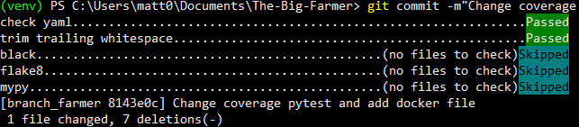
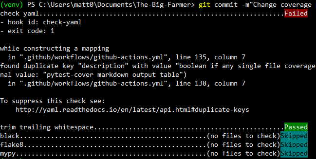

# THE BIG FARMER
We are the biggest farmer's you never seen !

## I - Installation des dépendances -
Les dépendences sont indispensables pour pouvoir éxecuter le programme ensuite. Le fichier contient alors des packages nécessaires, qu'il faudra installer :
```
pip install -r requirements.txt
```
## II - Mise en place des tests -
### 1. Intaller pytest sur votre machine
#### a. Travailler sur l'environnement virtuel :
ATTENTION ! Veillez à bien activer l'envrionnement virtuel (venv)

    * Windows : `venv\Scripts\activate.bat`
    * Unix/MacOS : `source venv/bin/activate`
#### b. Installation de pytest :
```
pip install -u pytest
```
#### c. Tests avec pytest :
Se rendre dans le répertoire sur lequel effectuer les tests avec le terminal et éxecuter la/les ligne(s) suivante(s):

- Exécute tous les fichiers comportant dans leur nom 'test_nom.py' : `pytest`
- Exécute le test de tout les fichiers et affiche les détails des tests par fonction : `pytest -rA`
- Exécute le test d'un fichier en particulier et affiche les détails du tests par fonction : `pytest test_farmer.py -rA`
- Exécute le test sur toutes les fonctions en particulier : `pytest -rA -k "test_nom"`
- N'exécute que le test sur une fonction en particulier d'un fichier en particulier :
`pytest test_farmer.py -rA -k "test_nom"`
- Exécute le test sur toutes les fonctions en particulier et affiche les détails : `pytest -rA -k "test_nom" -v`

## III - Mesurer la couverture de code -
### 1. Intaller pytest + plugin coverage sur votre machine
#### a. Travailler sur l'environnement virtuel :
ATTENTION ! Veillez à bien activer l'envrionnement virtuel (venv)

    * Windows : `venv\Scripts\Activate.ps1`
    * Unix/MacOS : `source venv/bin/activate`
#### b. Installation de pytest + plugin coverage :
```
pip install pytest-cov
```
#### c. Prise en charge des tests distribués :
Pour cela il est nécessaire d'isntaller `-xdist`
```
pip install pytest -xdist
```
#### d. Tests avec pytest-cov :
Se rendre dans le répertoire sur lequel effectuer les tests avec le terminal et éxecuter la ligne suivante
```
pytest --cov
```
Produirait un rapport comme :

```
---------- coverage: platform win32, python 3.10.9-final-0 -----------
Name                 Stmts   Miss  Cover
----------------------------------------
class_Fonctions.py     290    263     9%
test_farmer.py          19      0   100%
----------------------------------------
TOTAL                  309    263    15%
```
# = AIDE LANCEMENT DU JEU =
### : Connexion au serveur :
Dans un premier terminal de commande entrer la ligne suivante
```
python3 -m chronobio.game.server -p $port
```
Remplacer $port par un numéro de serveur > 1024
### : Démarrage du fichier jeu :
Dans un deuxième terminal entrer la ligne suivante
```
python3 name_game_file.py -p $port -u THE_BIG_FARMER
```
Remplacer $port par le même numéro de serveur que précédement en respectant la condition > 1024

### : Partie graphique :
### 1A - Création de l'espace virtuel WINDOWS
```
python3 -m venv venv
```
### 1B - Création de l'espace virtuel UBUNTU
```
sudo apt install python3-venv
python3 -m venv my-project-env
```
### 2A - Activation de l'espace virtuel WINDOWS
```
venv\Scripts\Activate.ps1
```
### 2B - Activation de l'espace virtuel UBUNTU
```
source my-project-env/bin/activate
$ source my-project-env/bin/activate (my-project-env) $
```
### 3 - Démarrer le jeu - graphique
```
python -m chronobio.viewer -p $port
```
Remplacer $port par le même numéro de serveur que précédement en respectant la condition > 1024

/!\ Il faut garder les terminaux ouverts /!\

# = PRE-COMMIT =
Des pre-commit sont disponibles au sein de projet, dans le but de vérifier certains éléments avant la mise à jour sur le projet au global.
## Comment cela fonctionne ?
Et bien c'est tout simple, ceux sont des vérifications qui sont faites sur les fichiers du projet ou un fichier en particulier (ex : le fichier de jeu), afin d'identifier des erreurs avant d'effectuer une mise à jour sur le dépôt github de la Team.
Les vérifications seront les suivantes :
- PEP8
- Format du code grâce au check de blake
- Les annotations types et leurs vérifications
## Visuel "PASSED"



## Visuel "FAILED



Il y a de nombreux avantage à cela, il nous permet de voir no erreurs et ainsi d'effectuer la modification demandée avant le prochain commit sur la branche.